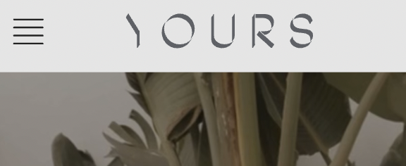

# Procesverslag
Markdown is een simpele manier om HTML te schrijven.  
Markdown cheat cheet: [Hulp bij het schrijven van Markdown](https://github.com/adam-p/markdown-here/wiki/Markdown-Cheatsheet).

Nb. De standaardstructuur en de spartaanse opmaak van de README.md zijn helemaal prima. Het gaat om de inhoud van je procesverslag. Besteedt de tijd voor pracht en praal aan je website.

Nb. Door *open* toe te voegen aan een *details* element kun je deze standaard open zetten. Fijn om dat steeds voor de relevante stuk(ken) te doen.

## Jij

  
uitwerken voor kick-off werkgroep

  ### Auteur:
  Fleur van Kimmenaede

  #### Je startniveau:
  Blauw

  #### Je focus:
  Surface plane
 

## Je website

  
uitwerken voor kick-off werkgroep

  ### Je opdracht:
  https://www.thisisyours.es/nl/ 

  #### Screenshot(s) van de eerste pagina (small screen): 
YOURS  

  #### Screenshot(s) van de tweede pagina (small screen):
  hier de naam van de pagina  
  
 

## Toegankelijkheidstest 1/2 (week 1)

  
uitwerken na test in 2e werkgroep

  ### Bevindingen
  Lijst met je bevindingen die in de test naar voren kwamen:
  Tijdens het gebruik van de screenreader bij de website yours ben ik tot een aantal ontdekkingen gekomen.
  Er word geen h1 gebruikt op de website. Het logo boven aan de webiste staat niet in een h1. De screenreader 
  leest de naam van het hotel dus ook niet op. Als je door gaat naar het hamburger menu leest hij ook niet 
  voor dat dit een hamburger menu is. Hij verteld alleen dat het een venster menu is met een navigatie
  daarin. Als je door het hamburger menu heen tabt en de screenreader is bij het laatste list item gekomen, springt 
  hij over naar de content die op de pagina zelf staat. Dit kan je echter nog niet zien omdat het hamburger menu
  nog uitgeklapt is. Het is op dit moment dus niet duidelijk waar de screenreader het over heeft. Ook heeft
  de website op de homepage een video staan. Deze video bevat een autoplay. Je kan de video dus niet handmatig
  uitschakelen. De video blijft oneindig door gaan. Wat betreft de alt teksten ontbreken er veel dingen. 
  Vaak word er geen alt tekst genoteerd of een tekst die niet relevant is voor het beeld dat word getoond. 
  Als we op de contact pagina aankomen zijn er ook een aantal punten te benoemen. Buiten dat het formulier
  goed word voorgelezen door de screenreader is het onderwerp contrast niet helemaal goed overgekomen op
  de website. Er worden nauwlijks vormen of lijnen gebruikt waardoor het een onduidelijk formulier is. 
  Ook de send button bevat geen enkele styling van een button. Als laatste kwam ik bij de footer aan. Met de 
  links en teksten is niks mis. Alleen betreft de styling is het heel onduidelijk. Er worden allerlij links 
  geplaatst die niet lijken op een klikbare link. Ze kunnen inplaats daarvan social media buttons gebruiken.

## Breakdownschets (week 1)

  
uitwerken na afloop 3e werkgroep

  ### de hele pagina: 
  

  ### dynamisch deel (bijv menu): 
  

## Voortgang 1 (week 2)

  
uitwerken voor 1e voortgang

  ### Stand van zaken
  Ik had in het begin een beetje moeite met de lessen. Buiten dat ik het leerzaam vond om meer
  over css te leren wilde ik eigenlijk gewoon beginnen met het maken van de website. Ik had zoveel
  zin om deze website te maken. Toen we dan ook een startschot kregen om te beginnen aan de website
  ben ik gelijk begonnen met het aanmaken van mijn pagina. Ik moest wel even 3x denken voordat ik
  weer door had hoe alles werkte aangezien het al weer een half jaar geleden was. Maar al snel had ik
  de flow weer te pakken. We kregen te horen dat voor de volgende les je eerste html pagina klaar moest
  zijn. Alle content moest erin staan. Vanaf daar zouden we beginnen met de css styling. Aangezien ik zo
  lekker bezig was in de lessen ben ik ook thuis aan de slag gegaan met mijn 2e html pagina. Ook deze
  heb ik gevuld met content. Op de eerste pagina stond niet zulke lastige conetent. Maar op de 2e pagina 
  ben ik bezig geweest met het maken van input velden. Ik wist nog van me vorige opdrachten hoe ik dit
  kon doen. Echter had ik toen geen styling gebruikt omdat ik geen idee had hoe het werkte. Ik hoop
  dat ik nu daar wel mee aan de slag kan. In de les had ik een link gemaakt om te switchen tussen
  de 2 pagina's. Het vormgeven hiervan ging echter iets minder goed. Ik wilde namelijk een bepaalde
  positie geven aan de link die niet geheel eenvoudig was. Gelukkig hadden we net een les gekregen over
  grids waardoor ik dat kon toepassen op het element. 

  

  ### Agenda voor meeting
  samen met je groepje opstellen

  Fleur: Ik wilde graag uitleg over een Iframe, invoervelden en classes. Ook wilde ik weten of mijn html goed geschreven    was.
  
  Stella: Zij wilde hulp bij Gitub en het positioneren van haar afbeeldingen.
  
  Kenza: Kenza had nog niks gemaakt en was er puur om van ons te leren.
  
  Bregtje: Bregtje wilde hulp bij het stylen vaan haar scrollbar en hoe je een hover plaatst.

  ### Verslag van meeting
  hier na afloop snel de uitkomsten van de meeting vastleggen

  - Het logo van je website moet worden geplaatst in de H1 van je site
  - Alle links die je plaatst in je website kunnen worden verwezen naar je andere pagina
  - Gebruik meer ruimte tussen je input velden
  - Maak een hamburger menu aan voor in de navigatie
  - Verander de Googlemaps afbeelding naar een Iframe
  - Je form is niet afgesloten
  - Je hebt nu 2 classes gemaakt voor elke html pagina, gebruik er maar 1
  - Je moet je html en css ordenen en groeperen
  - Zet in de body 30em neer, zo schaalt je website niet uit

## Voortgang 2 (week 3)

  
uitwerken voor 2e voortgang

  ### Stand van zaken
  Deze week ben ik verder gegaan met de styling van mijn 2 pagina's. Ik heb mijn feedback aangepast na het voortgangsgesprek. Hierna kon ik mij verder richten op de nieuwe tools die wij hebben geleerd in de les. De les deze week ging over states en animaties. We kregen een opdracht om bepaalde annimaties te maken. Zelf wilde ik graag een annimatie hebben op mijn verzend knop onder het invoerformulier. Ik heb na de opdracht de leukste annimatie eruit gehaald en die nagemaakt in mijn website voor de submit knop. Ook heb ik een hover gemaakt op deze knop. Verder liep ik erg vast met het maken van een hamburger menu. Ik opende dlo en begon met het maken van de opdracht over een hamburger menu. Ik snapte wel wat alles betekende alleen ik snapte niet de volgorde hoe ik deze code kon schrijven. Ik heb de code toch maar genoteerd in mijn html en javascript alleen werkte het niet. Ik besloot dit even te parkeren tot we het voortgangsgesprek hadden en daar om hulp te vragen. Ik ben toen verder gegaan aan het stylen van de inputvelden. Ik kwam erachter dat je ook valid/invalid kon gebruiken om een goede feedback te leveren aan de gebruiker. Ook speelde ik wat met de border type/style. Hier door heb ik een super leuk effect gecreeerd waardoor het lijkst alsof de input velden in de website zijn gegraveerd. Ik ben hier super trots op.

  
  
  
  
  
  
  

  ### Agenda voor meeting
  samen met je groepje opstellen

  Fleur: Ik wilde graag hulp bij het javascript. Ik had de code geschreven maar hij deed het niet en ik zag niet wat er fout was. (bleek dat ik javascript verkeerd had geschreven tijdens het linken aan de html pagina.)

  Sanne: Zij wilde hulp bij Gitub en het positioneren van haar afbeeldingen en het stylen van content.

  Kenza: Kenza had nog niks gemaakt en was er puur om van ons te leren.

  Bregtje: Bregtje wilde hulp bij het stylen van bepaalde elementen.

  ### Verslag van meeting
  hier na afloop snel de uitkomsten van de meeting vastleggen

  - Javasript ook linken op de 2e html pagina
  - Hamburger menu aanmaken op de 2e pagina
  - Andere afbeeldingen zoeken voor het hamburger menu

## Toegankelijkheidstest 2/2 (week 4)

  
uitwerken na test in 9e werkgroep

  ### Bevindingen
  Lijst met je bevindingen die in de test naar voren kwamen (geef ook aan wat er verbeterd is):
  Bij de tweede toegankelijkheidstest hebben we mijn eigen website getest. Als eerst begonnen we met de screenreader. Dit werkte eigenlijk perfect. Doormiddel van de alt teksten die ik had geschreven las de screenreader de juiste woorden voor. Zo las hij ook voor dat het hamburgermenu een hamburgermenu was. Bij de orginele website was dit niet het geval. Ik heb mijn logo in de H1 van mijn website geplaatst. Zo leest de screenreader de naam van mijn website voor. Dit was ook niet het geval bij de orginele website. Op de contact pagina werkt alles ook goed. Dit komt omdat ik een id heb gebruikt voor mijn labels. Ik heb de id de zelfde content gegeven als de label zodat de screenreader het thema van de input kan voorlezen. Wat betrerft het contrast van het formulier is er ook een hoop verbeterd. Op de orginele website worden er geen vormen en lijnen gebruikt waardoor het formulier niet overkomt als een input veld. Ik heb mij daarom extra gefocused op het stylen van het formulier. Ik heb duidelijke vormen en lijnen gebruikt waardoor het duidelijker is. Ook heb ik de button effecten gegeven waardoor het nog meer op een button lijkt in tegenstelling van de orginele website. Ik heb de footer ook aangepast. Ik heb geen gebruik gemaakt van teksten maar van icoons. Ik vind dat dit duidelijker en overzichtelijker oogt. Het icoon spreekt voor zichzelf en het doel is duidelijk. Door deze test ben ik erachter gekomen dat ik nog geen gebruik had gemaakt van een media query. Ik wist persoonlijk ook niet zo goed wat dit betekende dus ben ik wat research gaan doen. Al snel kwam ik er achter dat dit te maken had met een dark&light modus. Ik kon me nog herinderen dat we hier in de les een uitleg over hebben gekregen. Ik ben naar dlo gegeaan en ben door de powerpoints gaan zoeken. Ik vond toen een voorbeeld over dark&light modus. Ik ben hem na gaan maken in mijn eigen stijl en toen liep ik vast. De codes waren wel goed maar iets klopte er niet. Ik vroeg hulp aan een studente assistent en die vertelde mij dat ik geen root had. Ik had al mijn kleuren in de body aangesproken waardoor het dus niet werkten. Na dat hebben aangepast werkte de dark&light mode. 

## Voortgang 3 (week 4)

  
uitwerken voor 3e voortgang

  ### Stand van zaken
  De laatste week is aangebroken. Ik ben al erg ver in het afronden van mijn website. Er zijn wel een paar puntjes die nog wat meer aandacht mogen krijgen. Zo wilde ik graag radio buttons en checkboxen maken in mijn formulier. Ik heb deze code zo vaak moeten schrijven dat ik hem nu kan dromen. De code schrijven ging me dan ook gemakkelijk af. Alleen was er een probleem met de styling in css. Elke keer als ik de radio button of checkbox wilde aanspreken in mijn css reageerde hij nergens op. Zelf dacht ik dat dit kwam doordat ik een styling had gezet op alle forms. Ik snapte alleen niet waarom het dan alsnog niet werkte als ik een div of span plaatste om het element. Ik ben serieus wel 6 uur bezig geweest met het zoeken van dit probleem. En wat blijkt.... Ik had in mijn form moeten aangeven dat ik bepaalde elementen erbuiten wilde houden. Dit heb ik gedaan door de code " form>input. Hierdoor zeg je eigenlijk alles dat in de form staat komt na de input. (zie foto) Nadat ik dit heb gedaan werkte het en was mijn website eindelijk af. 

  
  
  

  

  ### Agenda voor meeting
  samen met je groepje opstellen

  Fleur: Ik wilde graag hulp bij Gitub en het controleren van mijn codes.

  Sara: Zij wilde hulp bij invalid en valid

  Kenza: Kenza had nog niks gemaakt en was er puur om van ons te leren.

  Bregtje: Bregtje wilde hulp bij het stylen van bepaalde elementen.

  ### Verslag van meeting
  hier na afloop snel de uitkomsten van de meeting vastleggen

  - Voeg een video toe aan de home page
  - Schrijf uitgebreider je alt teksten
  - Je website is nog wat karig dus voeg nog wat extra inputvelden toe en speel daar mee
  

## Eindgesprek (week 5)

  
uitwerken voor eindgesprek

  ### Je uitkomst - karakteristiek screenshots:
  
  
  
  
  
  
  

  ### Dit ging goed/Heb ik geleerd: 
 Ik heb echt dagen en nachten gewerkt aan mijn website. Ik vind coderen zo ontzettend lastig dat ik over de kleinste elementen al uren kan doen. Daarom gaat er bij mij ook zoveel tijd in zitten. Wat ik nu heb neer gezet ben ik echt heel erg trots op. De website lijkt bijna identhiek aan de orginele en dan ook nog is met verbeter punten. Ik kan begrijpen dat mijn website voor anderen wat karig overkomt aangezien ik niet zoveel content heb.Voor mij heb ik de lat hoog gelegt en heb ik dingen gemaakt waarvan ik 4 weken geleden niet eerder iets van wist. Ik heb mijn uiterste best gedaan om aan de slag te gaan met de styling. Ik heb bij dit vak geleerd wat voor eindeloze stylings opties er zijn met css. Ik heb me daarom ook daar het meest aan vast gehouden. Ik heb op gebied van css zoveel geleerd dat ik het ook gelijk heb gebruikt in de praktijk.

  ### Dit was lastig/Is niet gelukt:
  Tijdens het maken van een Iframe kreeg ik niet een optie om een alt tekst toe te voegen aan het Iframe. Op het moment dat ik er een screenrader over heen liet gaan zei die "kaart, kaart leeg" Dit komt omdat het frame in html leeg is en als je er op klikt je linkt naar de googlemaps vieuw. Ik heb geprobeerd een alt tekst er bij te schrijven maar ook dan las die voor kaar, kaart leeg. Toen heb ik een aria-label toegevoegd, maar ook dan zegt die kaart, kaart leeg. 

  
  

## Bronnenlijst

  
continu bijhouden terwijl je werkt

  Nb. Wees specifiek ('css-tricks' als bron is bijv. niet specifiek genoeg). 
  Nb. ChatGpT en andere AI horen er ook bij.
  Nb. Vermeld de bronnen ook in je code.

  1. Voor het plaatsen van een video in html heb ik deze bron gebruikt: https://www.w3schools.com/tags/tag_video.asp 
  2. Voor het plaatsen van een input veld in html heb ik deze bron gebruikt: https://www.w3schools.com/tags/tag_input.asp
  3. Voor het plaatsen van een radio button in html heb ik deze bron gebruikt: https://developer.mozilla.org/en-US/docs/Web/HTML/Element/input/radio
  4. Voor het bewerken van een radio button in css heb ik deze bron gebruikt:  https://moderncss.dev/  pure-css-custom-styled-radio-buttons/ 
  5. Voor het maken van een checkbox heb ik deze bron gebruikt: https://developer.mozilla.org/en-US/docs/Web/HTML/Element/input/checkbox en https://www.w3schools.com/tags/att_input_type_checkbox.asp 
  6. Voor het maken van een hamburger menu heb ik deze bron gebruikt: https://codepen.io/shooft/pen/rNoawEj 
  7. Alle afbeeldingen komen van: https://www.thisisyours.es/nl/ 
  8. De video komt van: https://www.thisisyours.es/nl/ 
  9. Het iframe komt van: https://www.google.com/maps/place/YOURS+Boutique+Stay/@39.4620089,-0.3769794,17z/data=!3m1!4b1!4m9!3m8!1s0xd604f175513cccd:0xb280fd8c9f701b38!5m2!4m1!1i2!8m2!3d39.4620089!4d-0.3769794!16s%2Fg%2F11r1g4wdln?entry=ttu 
  10. Voor het plaatsen van een bestand input heb ik deze bron gebruikt: https://developer.mozilla.org/en-US/docs/Web/HTML/Element/input/file 
  11. Voor het plaatsen van een date input heb ik deze bron gebruikt: https://www.w3schools.com/tags/att_input_type_date.asp
  12. Voor het plaatsen van een drop down menu heb ik deze bron gebruikt: https://blog.hubspot.com/website/html-dropdown

